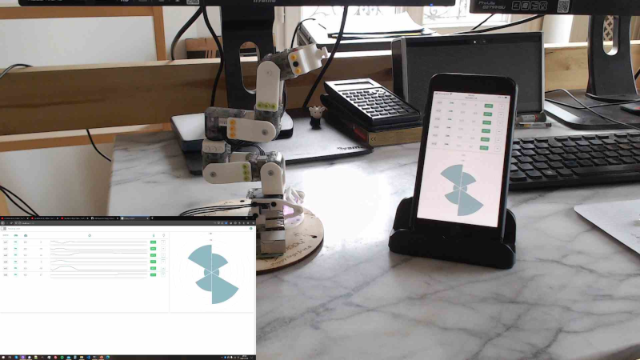
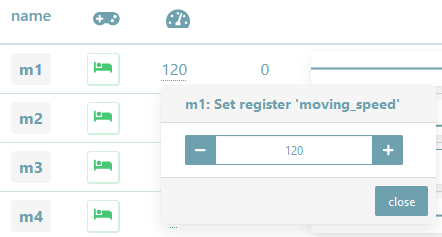
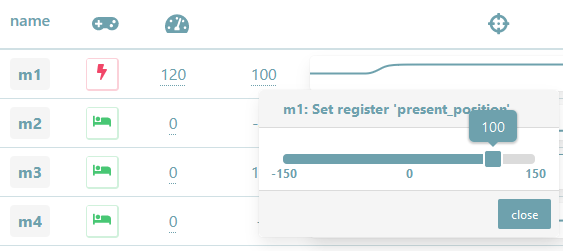
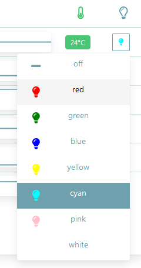

# Poppy Robot UI

![GitHub package.json version][version-img]
[![JavaScript Style Guide][standard-image]][standard-url]
[![Dependency Status][david-image]][david-url]
[![devDependency Status][david-dev-image]][david-dev-url]

Responsive web app to monitor/control robots of the [Poppy project][poppy-project-url] family based on Vue.js and the [poppy-robot-core](https://github.com/nbarikipoulos/poppy-robot-core#readme) module.

It allows:
- Displaying register of interest of motors of a Poppy robot (at least a Poppy Ergo Jr.),
- Settings compliant/stiff state, speed, position and led (for XL-320 motor).



A demonstration video is available [here](https://www.youtube.com/watch?v=vkAI09Vu6qc).

<!-- toc -->

- [Screenshots](#screenshots)
  * [Overview](#overview)
    + [Wide Screens](#wide-screens)
    + [Mobile Devices](#mobile-devices)
  * [Setting Registers](#setting-registers)
- [Install](#install)
  * [Build Project](#build-project)
  * [Serve Build](#serve-build)
- [Versioning](#versioning)
- [Credits](#credits)
- [License](#license)

<!-- tocstop -->

## Screenshots

### Overview

#### Wide Screens

")

")

#### Mobile Devices

")

### Setting Registers

The current version allow to set the following registers of motors:
- 'compliant' (aka the compliant/stiff state),
- 'position' (when motor state is stiff),
- 'moving_speed',
- at last the led register.

position|speed|led
---|---|---
| | |


## Install

### Build Project

The build process is based on vueJS cli tooling that requires node.js (basic installation guide could be found [here](https://github.com/nbarikipoulos/poppy-robot-cli#installing-nodejs) if needed.)

- Clone this repository anywhere on your computer:

```shell
git clone https://github.com/nbarikipoulos/poppy-robot-ui.git
```

- Open a terminal in this folder and type:

```shell
npm install
npm run build // Compiles and minifies for production in dist/
```

### Serve Build

Just serve the dist folder __with any http server__ (Note it __does not require node.js__ at all).

Below example with the serve npm package:
```shell
npx serve dist
┌──────────────────────────────────────────────────┐
│                                                  │
│   Serving!                                       │
│                                                  │
│   - Local:            http://localhost:5000      │
│   - On Your Network:  http://192.168.1.14:5000   │
│                                                  │
│   Copied local address to clipboard!             │
│                                                  │
└──────────────────────────────────────────────────┘
```

## Versioning

While it's still in beta, version will follow v0.Y.Z, where:
- Y: Major,
- Z: Minor or patch.

## Credits

- Nicolas Barriquand ([nbarikipoulos](https://github.com/nbarikipoulos))

## License

The poppy-robot-ui is MIT licensed (details available [here](./LICENSE.md)) except for:
  - The poppy logo which is under [CC BY-SA 4.0][cc-by-sa-url] (see [here][poppy-project-url]).


[standard-url]: https://standardjs.com
[standard-image]: https://img.shields.io/badge/code_style-standard-brightgreen.svg

[version-img]: https://img.shields.io/github/package-json/v/nbarikipoulos/poppy-robot-ui

[david-image]: https://img.shields.io/david/nbarikipoulos/poppy-robot-ui.svg
[david-url]: https://david-dm.org/nbarikipoulos/poppy-robot-ui
[david-dev-image]: https://img.shields.io/david/dev/nbarikipoulos/poppy-robot-ui.svg
[david-dev-url]: https://david-dm.org/nbarikipoulos/poppy-robot-ui?type=dev

[cc-by-sa-url]: https://creativecommons.org/licenses/by-sa/4.0/
[poppy-project-url]: https://www.poppy-project.org